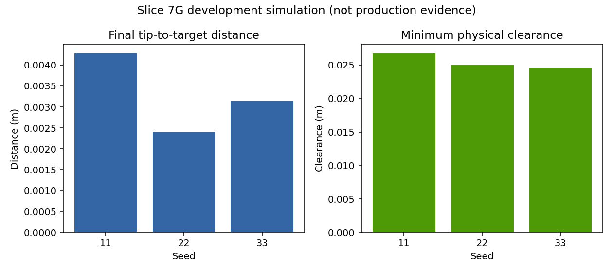
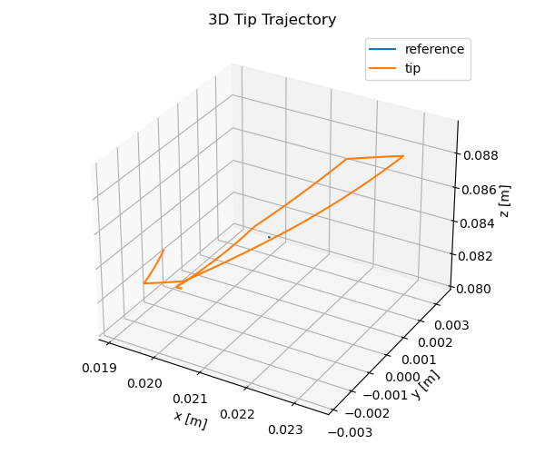
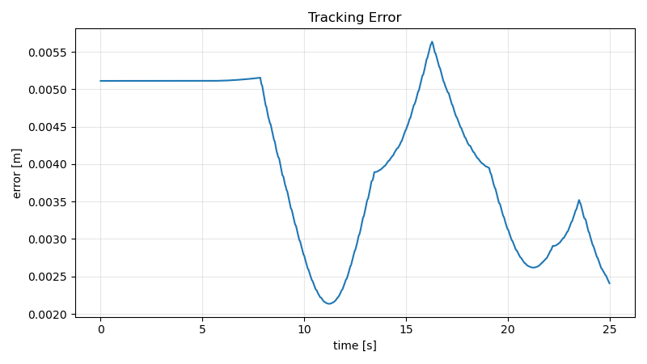
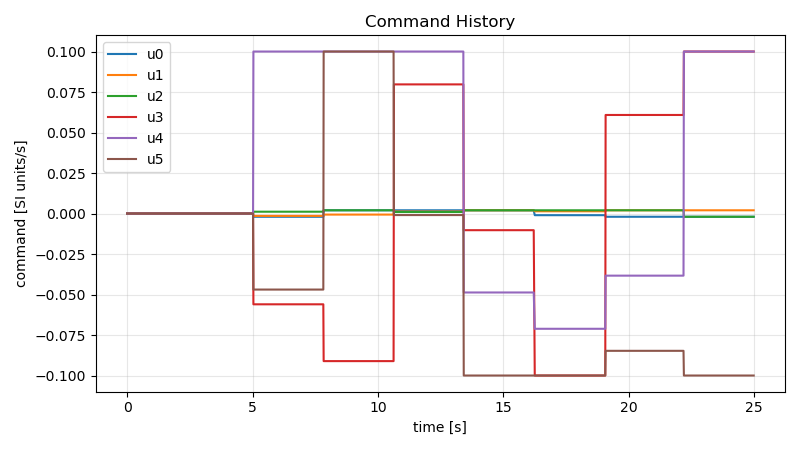

# Slice 7G Development Simulation Results

> **Development-simulation result only; not production promotion evidence.**

The workflow used only the software simulator, simulated tactile input, and the safety supervisor.
No production authority, budget, domain lease, evidence seal, or campaign attempt was used.

## Build and tests

- Isolated non-symlink ROS 2 build: 8/8 requested packages succeeded.
- Final practical functional suite: 880 passed, 0 failed, 0 skipped/xfail.
- Generated `ctr_interfaces/msg/CtrTactileState` and installed console entry points were imported and enumerated successfully.

## Results

| Kind | Seed | Status | ROS domain | Readiness (s) | Final error (m) | RMSE (m) | Min clearance (m) | Collisions | Command Hz | Safety/tactile events | Failure |
| --- | ---: | --- | ---: | ---: | ---: | ---: | ---: | ---: | ---: | --- | --- |
| smoke | 11 | passed | 186 | 2.06861 | 0.0029794 | 0.00487289 | 0.0278214 | 0 | 49.9759 | 0/0 |  |
| example | 11 | passed | 197 | 2.26732 | 0.00427872 | 0.00392092 | 0.0267384 | 0 | 50.0082 | 0/0 |  |
| example | 22 | passed | 194 | 2.57945 | 0.00240924 | 0.00417498 | 0.0250078 | 0 | 49.9968 | 0/0 |  |
| example | 33 | passed | 126 | 2.27778 | 0.00314048 | 0.00407783 | 0.024566 | 0 | 49.9896 | 0/0 |  |

## Plots



Representative seed-22 plots:







## Visual simulation

After sourcing ROS and this workspace install, run:

```bash
ROS_DOMAIN_ID=166 ros2 launch ctr_bringup slice_7g_development_visual.launch.py development_simulation:=true seed:=11
```

The RViz view shows the CTR/lumen marker array, reference path, and tip pose. The fixed domain is an example; choose another unused domain if 166 is occupied.

## Known limitations

- Results are software-simulation evidence only.
- Controller timing is descriptive and Python MPPI may not be real-time capable.
- Hardware, privileged installation, production cleanup authority, and physical validation remain untested.
