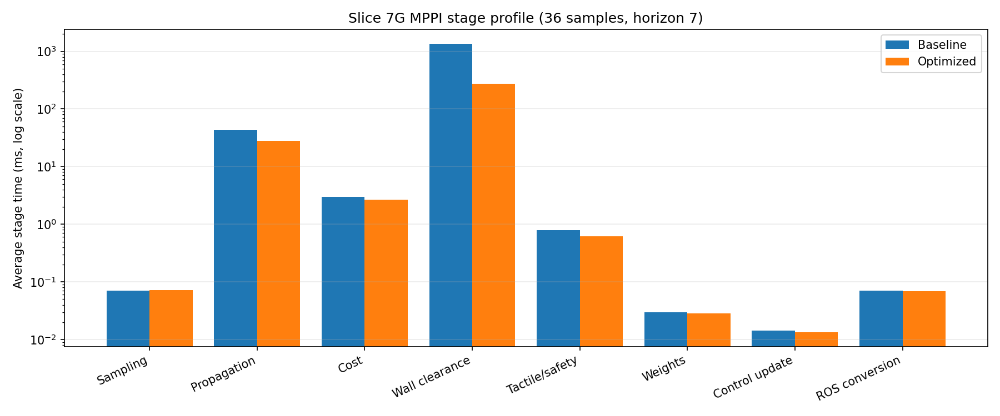
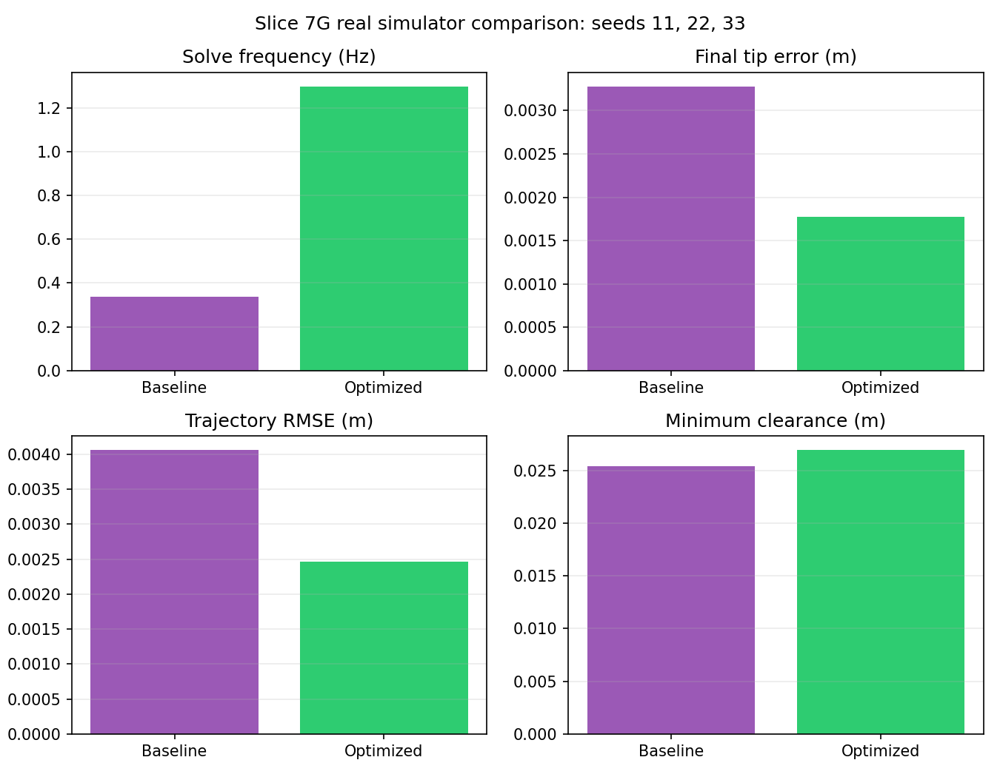
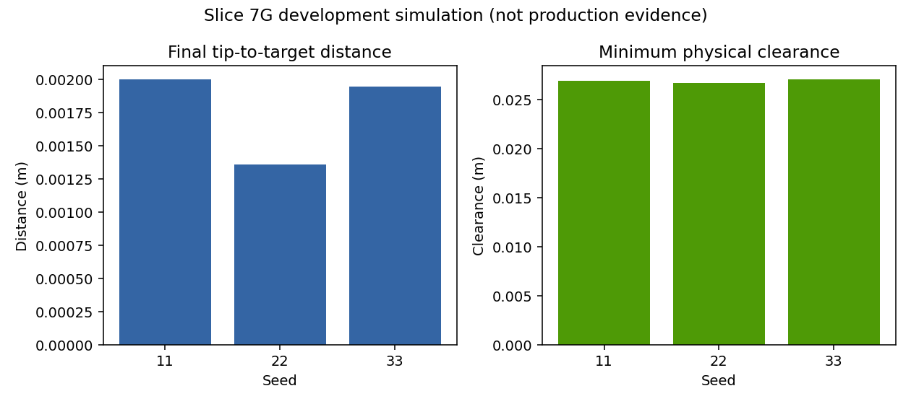

# Slice 7G Development MPPI Performance Comparison

> Development-simulation result only. This is not production promotion evidence.

## Revisions and configuration

- Baseline commit: `5bdf89414e73974c6ded0511e9d7007b83b28f05`
- Optimized source commit: `ec6626c605390a7af464c2b5557db0df8e19c63e`
- Target: Ubuntu 22.04, ROS 2 Humble, simulator only
- Task: curved-lumen navigation, circular arc, centerline target
- MPPI profile: unchanged `cylinder_fast` profile (36 samples, horizon 7)
- Example duration: 25 seconds per seed; seeds 11, 22, and 33
- Baseline result root: `evaluation_results/slice_7g_development_20260823T005500Z`
- Optimized result root: `evaluation_results/slice_7g_performance_optimized_20260823T014418Z`

No production profile, privileged service, attempt budget, hardware path, sample count, horizon, or cost weight changed.

## Source changes

- Project complete backbone point batches against each centerline segment with NumPy while preserving the original sequential projection tie rule.
- Cache immutable joint-limit and model scale arrays instead of rebuilding them for every forward-kinematics call.
- Reuse the deterministic final rollout model result for terminal cost evaluation.
- Add scalar-versus-batched projection equivalence and scalar-path exclusion regressions.

## Offline MPPI stage profile

Eight warmed solves were measured before and after the change with identical seed, state, reference, sample count, horizon, geometry, tactile input, and controller configuration. Times are milliseconds.

| Stage | Baseline avg | Baseline median | Baseline p95 | Baseline max | Optimized avg | Optimized median | Optimized p95 | Optimized max |
| --- | ---: | ---: | ---: | ---: | ---: | ---: | ---: | ---: |
| Total solve | 1466.888 | 1469.660 | 1493.623 | 1495.887 | 370.236 | 368.625 | 374.944 | 375.570 |
| Sampling | 0.070 | 0.070 | 0.074 | 0.075 | 0.072 | 0.068 | 0.086 | 0.091 |
| State propagation | 43.105 | 43.281 | 44.098 | 44.152 | 27.757 | 27.675 | 28.244 | 28.253 |
| Cost evaluation | 2.953 | 2.945 | 3.055 | 3.065 | 2.683 | 2.679 | 2.714 | 2.718 |
| Collision/wall clearance | 1349.516 | 1351.546 | 1374.405 | 1377.305 | 270.866 | 270.105 | 274.001 | 274.290 |
| Tactile/safety cost | 0.792 | 0.748 | 0.913 | 0.918 | 0.615 | 0.579 | 0.706 | 0.710 |
| Weight normalization | 0.030 | 0.029 | 0.035 | 0.037 | 0.028 | 0.028 | 0.030 | 0.031 |
| Control update | 0.014 | 0.013 | 0.022 | 0.070 | 0.013 | 0.013 | 0.014 | 0.026 |
| ROS message conversion | 0.070 | 0.054 | 0.078 | 25.968 | 0.069 | 0.055 | 0.064 | 25.681 |

The average offline solve time decreased by 74.76%. The batch peak RSS for the complete optimized smoke-plus-three-seed workflow was 178,524 KiB (174.34 MiB); the microprofile reported no measurable RSS growth over its warmed solve loop.



## Recording and metric-finalization profile

The recorder runs after controller execution, outside the control-critical path. The three example runs produced more aligned samples after optimization, so raw-write time increased, while the vectorized lumen metric pass still became substantially faster.

| Stage | Baseline avg | Baseline median | Baseline p95 | Baseline max | Optimized avg | Optimized median | Optimized p95 | Optimized max |
| --- | ---: | ---: | ---: | ---: | ---: | ---: | ---: | ---: |
| Raw evidence write | 697.131 | 706.847 | 735.621 | 738.818 | 1154.215 | 1144.247 | 1198.458 | 1204.481 |
| Lumen clearance/progress | 15225.913 | 15014.888 | 15786.280 | 15871.990 | 5868.279 | 5805.371 | 5986.395 | 6006.509 |
| Complete lumen evaluation | 15355.399 | 15133.237 | 15920.513 | 16007.989 | 6076.234 | 6019.353 | 6207.120 | 6227.983 |

## Real simulator results

All optimized smoke/example attempts passed readiness and artifact validation, reported clean child cleanup, and recorded zero safety or tactile-invalid events.

| Seed | Solve Hz before | Solve Hz after | Final error before (m) | Final error after (m) | RMSE before (m) | RMSE after (m) | Min clearance before (m) | Min clearance after (m) | Collisions |
| ---: | ---: | ---: | ---: | ---: | ---: | ---: | ---: | ---: | ---: |
| 11 | 0.3144 | 1.3462 | 0.004279 | 0.002001 | 0.003921 | 0.002103 | 0.026738 | 0.026943 | 0 |
| 22 | 0.3497 | 1.3117 | 0.002409 | 0.001360 | 0.004175 | 0.002443 | 0.025008 | 0.026740 | 0 |
| 33 | 0.3479 | 1.2328 | 0.003140 | 0.001949 | 0.004078 | 0.002841 | 0.024566 | 0.027083 | 0 |
| **Mean** | **0.3373** | **1.2969** | **0.003276** | **0.001770** | **0.004058** | **0.002462** | **0.025437** | **0.026922** | **0** |

Mean effective solve frequency improved by 284.48%. Mean RMSE improved by 39.33%; mean final error improved by 45.98%; mean minimum wall clearance increased by 1.485 mm. This establishes a useful simulation speedup, not a real-time claim.





## RViz visual evidence

The live seed-11 visualization showed the curved lumen, lumen centerline/reference, CTR backbone history, target marker, tip pose, and an `OK` RViz global status. Four representative 1200×800 captures are retained:

- [Initial/configuration view](visual/seed11_initial_configuration.png)
- [Mid-run view](visual/seed11_mid_run.png)
- [Final/converged view](visual/seed11_final.png)
- [Alternate camera view](visual/seed11_alternate_angle.png)

No video was created because no screen-video encoder was installed. The local X11 RViz workflow itself ran successfully. The initial safety-node SIGSEGV did not reproduce in later controlled testing. After correcting a separately observed shutdown-only ROS 2 Humble message-conversion exception, a fresh 10/10 visual shutdown run completed with all required exit codes zero and no surviving process. See [the shutdown reliability report](visual_shutdown_reliability.md).

### Curved-lumen visualization update

The 2026-08-25 usability update changes the RViz fixed frame from the
nonexistent `base_link` root to `world` and supplies the semantically correct
fixed `world -> base_link` transform for the fixed-base simulator. The analytic
`CurvedLumen` centerline and radius samples now produce a 7,560-point
`TRIANGLE_LIST` wall at alpha 0.20. Its parallel-transport frames are the same
continuous frames used by the established lumen marker construction; the
surface does not replace collision geometry.

Static surface, wireframe, and centerline topics are reliable/transient-local
and publish once. Dynamic per-component topics publish at the configured 5 Hz,
the exact controller-owned reference is magenta, and actual `/ctr/tip` history
is bright green, time-decimated to 0.05 s, and capped at 500 points. These
publishers require the explicit visual launch opt-in and are absent from normal
headless development runs. A one-second visual-launch-only safety startup grace
prevents the safety watchdog from latching before the simulator's first state;
the default delay and every safety threshold remain unchanged.

- [Updated RViz display panel and initial scene](visual/seed11_rviz_lumen_initial.png)
- [Mid-run internal trajectory view](visual/seed11_rviz_lumen_mid_run.png)
- [Final tip/target relationship](visual/seed11_rviz_lumen_final.png)
- [Surface disabled to expose internal geometry](visual/seed11_rviz_lumen_surface_disabled.png)

The final live domain-108 check reported RViz Global Status OK, `safety=ready`,
changing tip positions, and clean zero-exit shutdown for all seven owned
processes. A fresh headless smoke plus 25-second seed-11 example also passed;
the example retained zero collisions and achieved 1.3676 effective solves/s,
0.002138 m RMSE, and 0.027021 m minimum clearance. This is simulator-only
development evidence, not a real-time or production claim.

## Reproduction

Build:

```bash
source /opt/ros/humble/setup.bash
colcon --log-base log_slice7g_development build \
  --build-base build_slice7g_development \
  --install-base install_slice7g_development \
  --packages-select ctr_interfaces ctr_bringup ctr_model ctr_mppi_controller \
  ctr_tactile ctr_sim ctr_safety ctr_evaluation
```

Headless smoke and example seeds (the workflow chooses fresh ROS domains):

```bash
source /opt/ros/humble/setup.bash
source install_slice7g_development/setup.bash
ros2 run ctr_evaluation ctr_run_slice_7g_development \
  --development-simulation \
  --smoke-duration 5 \
  --duration 25 \
  --seeds 11 22 33 \
  --output-root evaluation_results/slice_7g_performance_reproduction
```

Interactive RViz seed 11 (choose another unused domain if 166 is occupied):

```bash
source /opt/ros/humble/setup.bash
source install_slice7g_development/setup.bash
DISPLAY=:0 ROS_DOMAIN_ID=166 ros2 launch ctr_bringup \
  slice_7g_development_visual.launch.py development_simulation:=true seed:=11
```

## Limitations

- This is simulator-only development evidence; no physical hardware or production authority path ran.
- The optimized Python controller remains about 1.30 Hz in the full ROS workflow and is not claimed to be real time.
- The first RViz Ctrl-C exposed one transient safety-node shutdown SIGSEGV that did not reproduce in the later 10-cycle controlled run. EVAL-005 remains a historical, low-priority observation rather than a claim of exhaustive graphics-stack reliability.
- Production attempts consumed: 0.
