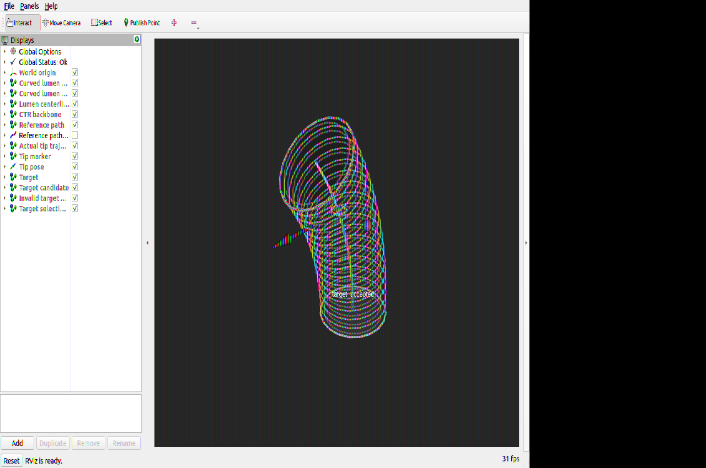

# Slice 7G Development Target Selection

> Simulator-only development result. This is not production promotion evidence
> and consumed no production attempt.

## Target contract

- `profile` remains the default. The visual profile target is the unchanged
  `[0.015, 0.005, 0.100] m` point in `base_link`.
- `cli` uses exact, unprojected metre coordinates in `base_link`.
- `rviz` consumes `/ctr/target_point_candidate` (`PointStamped`) in `world` or
  `base_link`; the established `world -> base_link` transform is identity.
- MPPI consumes one terminal position. Pose orientation is an identity
  placeholder and does not affect control.
- Selection is one-shot: after the first accepted reference, later candidates
  are rejected until the launch is restarted.

## Installed runtime checks

| Case | Seed/domain | Raw input (m) | Accepted target (m) | Projection | Result | Collisions |
| --- | --- | --- | --- | ---: | --- | ---: |
| Profile smoke + 25 s example | 11 / 123, 116 | existing profile/scenario | unchanged profile/scenario | 0 | passed | 0 |
| CLI 25 s example | 11 / 139 | `[0.0166457424, 0.00397477634, 0.102231139]` | same | 0 | passed | 0 |
| RViz invalid | 11 / 174 | `[0.0, 0.1, 0.08]` in `world` | none | rejected beyond 0.035 m | `target_projection_too_far`; no command | n/a |
| RViz surface click | 11 / 174 | `[0.01924686842428271, 0.03, 0.08098413850007993]` in `world` | `[0.01924686842428271, 0.0, 0.08098413850007993]` | 0.030 m | accepted; CTR moved | no collision indication |

The RViz run reported `waiting_for_target` and produced no MPPI command before
selection or after the invalid candidate. The accepted reference contained one
real pose and the yellow target ring matched it exactly. Tip samples changed
from `[0.0191842355, -0.0006517946, 0.08]` to
`[0.0198401937, 0.0003402502, 0.0816347730]`. A later candidate returned
`target_update_rejected_motion_started`, and the reference remained unchanged.
All seven launch-owned processes exited zero after one SIGINT; no child remained.

The profile 25-second example achieved 1.3098 Hz effective solve frequency,
0.002131 m RMSE, 0.027476 m minimum wall clearance, and zero collisions. The
different CLI target achieved 1.3840 Hz, 0.013070 m RMSE, 0.014140 m minimum
clearance, navigation success, and zero collisions.

## Visual evidence



RViz Global Status was `OK`. The toolbar includes **Publish Point**, the status
text is `target_accepted`, and all established lumen/CTR/reference/trajectory
displays remain enabled.

## Reproduction

```bash
source /opt/ros/humble/setup.bash
source install_slice7g_development/setup.bash

# Existing deterministic visual target
ROS_DOMAIN_ID=171 ros2 launch ctr_bringup \
  slice_7g_development_visual.launch.py \
  development_simulation:=true target_source:=profile seed:=11

# Exact tested CLI target
ROS_DOMAIN_ID=172 ros2 launch ctr_bringup \
  slice_7g_development_visual.launch.py \
  development_simulation:=true target_source:=cli \
  target_x:=0.0166457424 target_y:=0.00397477634 \
  target_z:=0.102231139 seed:=11

# Interactive RViz target
ROS_DOMAIN_ID=173 ros2 launch ctr_bringup \
  slice_7g_development_visual.launch.py \
  development_simulation:=true target_source:=rviz seed:=11
```

For the interactive run, choose **Publish Point**, click the visible wall or
centerline, and record the accepted coordinates from:

```bash
ros2 topic echo --once /ctr/target_selection/record std_msgs/msg/String
```

Replay the `validated_target` values as `target_x`, `target_y`, and `target_z`.

## Limitations

- RViz's planar **2D Goal Pose** tool is intentionally unsupported.
- The deterministic sampled approximate-model reachability gate is a
  development sanity check, not a formal inverse-kinematics proof.
- Live replanning is not implemented; restart to select another target.
- No hardware, production authority, or production attempt was exercised.
